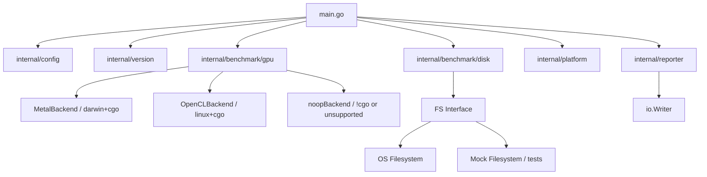

# iopsbench-mini

A lightweight Go-based benchmarking tool that measures host **disk IOPS** and **GPU/CPU read-write latency** across multiple platforms and architectures.

## Features

- **Disk I/O Benchmarking**
  - Sequential Read / Write
  - Random Read / Write / Mixed
  - Configurable block size, file size, duration, and read/write ratio

- **GPU/CPU Latency Benchmarking**
  - Host-to-Device (H2D) and Device-to-Host (D2H) transfer latency & bandwidth
  - Minimal kernel round-trip latency
  - **Per-architecture GPU backends**:
    - **macOS (Intel & Apple Silicon)** — Apple Metal via CGO
    - **Linux (x86_64)** — OpenCL via CGO (AMD, NVIDIA, Intel GPUs)
    - **Linux (ARM64)** — Core benchmarks available; GPU requires native build with OpenCL headers

- **Cross-Platform & Cross-Architecture**
  - Prebuilt release binaries for `darwin/amd64`, `darwin/arm64`, `linux/amd64`, and `linux/arm64`
  - Version embedded at build time (`-version` flag)

## Principles

- **Separation of Concerns**: Each package has a single responsibility (config, platform detection, benchmarking, reporting).
- **Interface-Driven Design**: The disk and GPU benchmarkers implement clean Go interfaces, enabling mocking for unit tests.
- **Build Tags for Portability**: Platform-specific GPU backends are isolated using Go build tags (`darwin`/`linux`, `cgo`/`!cgo`).
- **Testability**: Mock implementations and dependency injection (e.g., `io.Writer` for reporter, `FS` interface for disk) allow fast, deterministic unit tests without requiring real hardware.

## Repository Layout

```
iopsbench-mini/
├── .github/
│   └── workflows/
│       └── release.yml                # GitHub Actions multi-arch release pipeline
├── internal/
│   ├── config/
│   │   ├── config.go                    # CLI flags & defaults
│   │   └── config_test.go               # Unit tests for configuration
│   ├── platform/
│   │   ├── platform.go                  # OS / arch / CPU detection
│   │   └── platform_test.go             # Unit tests for platform info
│   ├── reporter/
│   │   ├── reporter.go                  # Pretty-printing of results (io.Writer-based)
│   │   └── reporter_test.go             # Unit tests for formatting
│   ├── benchmark/
│   │   ├── disk/
│   │   │   ├── disk.go                  # Disk benchmarker with FS abstraction
│   │   │   └── disk_test.go             # Mock filesystem tests
│   │   └── gpu/
│   │       ├── gpu.go                   # GPU benchmarker interface & result types
│   │       ├── errors.go                # Common GPU errors
│   │       ├── mock.go                  # Mock implementation for tests
│   │       ├── noop.go                  # No-op fallback for unsupported platforms
│   │       ├── factory_darwin_nocgo.go  # macOS fallback when CGO disabled
│   │       ├── factory_linux_nocgo.go   # Linux fallback when CGO disabled
│   │       ├── factory_other.go         # Unsupported platform fallback
│   │       ├── metal.go                 # macOS Metal CGO wrapper
│   │       ├── metal_backend.m          # Objective-C Metal backend
│   │       ├── metal_backend.h          # C header for Metal backend
│   │       ├── opencl.go                # Linux OpenCL CGO wrapper
│   │       └── gpu_test.go              # Mock / noop tests
│   └── version/
│       └── version.go                   # Build-time version injection
├── pkg/
│   └── utils/
│       ├── utils.go                     # Shared helpers
│       └── utils_test.go                # Unit tests for utils
├── main.go                              # CLI entry point
├── go.mod                               # Go module definition
├── Makefile                             # Local build helpers
├── .gitignore                           # Git ignore rules
└── README.md                            # This file
```

## Building

Requires **Go 1.21+**.

### Local build (with version)

```bash
make build
```

Or manually:

```bash
go build -ldflags "-X iopsbench-mini/internal/version.Version=$(git describe --tags)" -o iopsbench-mini
```

### macOS

```bash
go build -o iopsbench-mini
```

Links against the **Metal** and **Foundation** frameworks automatically via CGO.

### Linux (OpenCL / AMD GPU support)

```bash
# Install OpenCL development headers
sudo apt-get install ocl-icd-opencl-dev   # Debian / Ubuntu
sudo dnf install ocl-icd-devel            # Fedora
sudo pacman -S opencl-headers ocl-icd     # Arch

go build -o iopsbench-mini
```

Any OpenCL-compatible driver (AMD ROCm, NVIDIA proprietary, Intel Compute Runtime) works at runtime.

### Cross-compilation notes

| Target | CGO | GPU Support |
|--------|-----|-------------|
| `darwin/amd64` | ✅ | Metal |
| `darwin/arm64` | ✅ | Metal |
| `linux/amd64` | ✅ | OpenCL |
| `linux/arm64` | ❌ | Disk only (build natively for GPU) |

## Usage

```bash
./iopsbench-mini [flags]
```

### Flags

| Flag          | Default     | Description                           |
|---------------|-------------|---------------------------------------|
| `-version`    | `false`     | Print version and exit                |
| `-filesize`   | `524288000` | Test file size in bytes (500 MB)      |
| `-blocksize`  | `4096`      | I/O block size in bytes               |
| `-duration`   | `10s`       | Duration of each benchmark            |
| `-dir`        | `.`         | Directory for test files              |
| `-random`     | `true`      | Run random I/O benchmarks             |
| `-readratio`  | `0.5`       | Read ratio for mixed benchmarks       |
| `-gpu`        | `true`      | Run GPU latency benchmarks            |

### Example

```bash
# Show version
./iopsbench-mini -version

# Run with custom settings
./iopsbench-mini -duration 5s -filesize 1073741824 -dir /tmp

# Skip GPU benchmarks
./iopsbench-mini -gpu=false
```

## Testing

Run the full test suite (no GPU hardware required — mocks are used):

```bash
make test
# or
go test ./...
```

Run with verbose output:

```bash
go test -v ./...
```

## CI / Release Pipeline

Pushing a Git tag (`v*`) triggers the [GitHub Actions workflow](.github/workflows/release.yml) that:

1. Builds binaries for `darwin/amd64`, `darwin/arm64`, `linux/amd64`, and `linux/arm64`
2. Injects the Git tag as the version via `-ldflags`
3. Creates a GitHub Release and attaches all binaries as artifacts

```bash
git tag v1.0.0
git push origin v1.0.0
```

## Architecture



## Extending

### Adding a new GPU backend

1. Create a new Go file with appropriate build tags (e.g., `//go:build linux && cgo`).
2. Implement the `gpu.Benchmarker` interface (`Init`, `Shutdown`, `BackendName`, `Benchmark`).
3. Provide a `New()` function in the same file returning your implementation.
4. Add a nocgo fallback if applicable (e.g., `factory_linux_nocgo.go`).

### Adding a new disk benchmark

1. Add a new entry to the benchmarks slice in `main.go`.
2. The `disk.Benchmarker` handles measurements automatically via `random` and `readRatio` parameters.

## License

MIT
